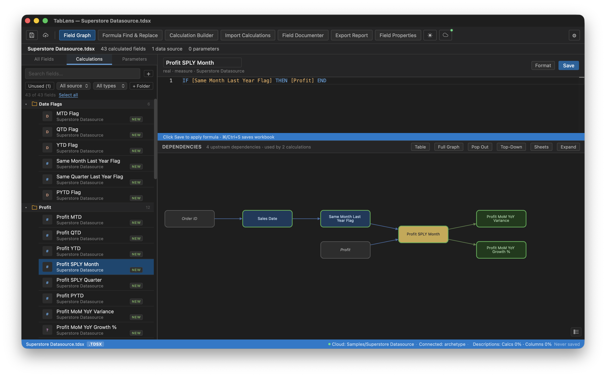

# Tab Lens

> A desktop IDE for Tableau workbooks. Document, edit, and build calculations across your entire workbook.



---

## The Problem

Tableau Desktop shows you one calculation at a time, in isolation. Tracing logic chains across dozens of interdependent calculations takes hours. Documenting what each field does is tedious, and most workbooks have zero documentation. Building families of time intelligence calculations is repetitive and error-prone. There is no way to see the big picture of how everything connects.

Tab Lens solves all of these.

---

## Key Features

### Tableau Cloud Integration

Connect to Tableau Cloud directly from Tab Lens. Browse your site's projects, open workbooks and data sources without manually downloading, and publish changes back when you're done.

- **Connect with a Personal Access Token (PAT)**: sign in once and stay connected across sessions. Credentials are stored securely in the OS keychain.
- **Browse projects**: navigate your Cloud site's project hierarchy, filter by workbooks or data sources, and open any item directly into Tab Lens.
- **Edit and publish**: make changes with all existing Tab Lens features (documentation, formulas, TI Builder, etc.), then publish back to Cloud with one click. No manual download/upload cycle.
- **Cloud origin tracking**: the status bar shows when a file was opened from Cloud and which project it belongs to.

---

### AI-Powered Workbook Documentation

The **Field Documenter** generates plain-English descriptions for every calculated field and raw data column in your workbook in a single session. No more undocumented workbooks.

**How it works:**
1. **Select** which fields to document. A coverage meter shows how much of your workbook is already documented.
2. **Estimate** the API cost transparently before any calls are made (both Anthropic and OpenAI pricing shown side by side).
3. **Generate** descriptions with live progress. Cancel anytime and keep what's completed.
4. **Review** every description before saving. Accept, reject, or edit inline. Nothing is written to your workbook without your explicit approval.

For calculated fields, the AI generates both a **plain-English description** and a **simplified human-readable version of the calculation logic**, making complex formulas accessible to non-technical stakeholders.

Descriptions are saved directly to the workbook XML, so they persist when the file is reopened in Tableau Desktop. The status bar shows live documentation coverage: *Descriptions: Calcs 85% · Columns 42%*. Click it to jump straight to undocumented fields.

You can also generate descriptions one field at a time from the **Field Properties** panel using the AI button, for both calculated fields and raw data columns.

### Export Report

Export structured markdown documentation for your workbook with three scope options:

- **Entire Workbook**: all calculated fields with formulas, raw columns, parameters, sets, and filters
- **Worksheet**: every calculation, column, parameter, and filter used on selected worksheets
- **Dashboard**: same as worksheet, with all child sheets included automatically

Each calculated field entry includes the description, a simplified calculation explanation, and the full Tableau formula in a code block.

---

### Time Intelligence Builder

Generate complete families of time period calculations in seconds. No more writing the same DATETRUNC/DATEDIFF patterns by hand.

**Time period flags:**
- **Current Period**: Today, WTD, MTD, QTD, YTD
- **Last Complete Period**: Day, Week, Month, Quarter, Year, H1, H2
- **Rolling / Trailing**: 7–90 days, 4–52 weeks, 3–24 months

**Fiscal calendar support:** Toggle between Standard and Fiscal. Quarter, year, and half-year flags automatically apply fiscal date arithmetic based on your fiscal year start month. No separate fiscal flags to manage.

**Rolling window control:** Choose "Thru Today" (includes the current partial day) or "Prior Only" (complete periods only, excluding today).

**Auto-variance:** Select Prior Period, Year over Year, or Both. The builder automatically generates the comparison period flags, absolute variance, and growth % calculations for every selected measure. No need to manually select or build prior period flags.

**Measure wrapping:** Select your base measures (Sales, Profit, etc.) and the builder creates filtered measure calculations for each time period flag.

---

### Cross-Workbook Calculation Import

Reuse calculations across workbooks without rebuilding them from scratch.

- **Browse any workbook**: open a second `.twb`/`.twbx` file read-only to browse its calculated fields
- **Dependency resolution**: when you select a field, its upstream dependencies are automatically detected and included. The full chain is shown inline with expand/collapse.
- **Conflict handling**: fields with duplicate names get a `(copy)` suffix, or you can rename/skip inline
- **Datasource auto-mapping**: when the target workbook has one datasource and the source differs, mapping is applied automatically

---

### Field Graph

Select any calculated field and instantly see its full upstream and downstream dependency chain as an interactive graph.

- **Color-coded nodes**: calculated fields (blue), parameters (purple), sets (coral), raw columns (grey), sheets/dashboards (slate)
- **Click to peek**: click any node to see its formula without losing your current focus
- **Collapsible table view**: toggle Table for a compact tree-table showing dependencies grouped by parent with expand/collapse. Click any row to peek its formula.
- **Sheet visibility**: toggle Sheets to see which worksheets and dashboards use each field
- **Raw field impact**: click any column from the Fields tab to see every downstream calculation that references it
- **Pop-out window**: open the graph in a separate OS-level window to keep it visible while you edit
- **Full graph mode**: see the entire workbook's dependency structure at once

---

### Formula Editor

A Monaco-powered editor (the same engine behind VS Code) with:

- Tableau-specific syntax highlighting (keywords, functions, field references, parameters, sets, LOD expressions)
- **Complete Tableau function coverage**: all 182 functions with autocomplete, parameter hints, and signature help showing expected arguments as you type
- **Real-time formula validation**:
  - Parenthesis and IF/CASE/END balance
  - Unknown function names and field references
  - Argument type checking (numeric functions flag date/string arguments, string functions flag numbers, etc.)
  - Nested aggregate detection, flagging `SUM(AVG(...))` and indirect nesting through calculated field references with proper LOD scope handling
  - CASE/WHEN syntax validation (missing THEN, misuse of `=` operator)
- **Type inference**: datatype and role (measure/dimension) auto-set when you save, based on formula content
- **Editable field name**: click the name above the editor to rename inline, like Tableau Desktop
- **Draft mode**: clicking `+` opens a blank editor immediately. The field is only created when you click Save.
- **Format** button: auto-indents nested IF/THEN/ELSE, CASE/WHEN, LOD expressions, and function calls

---

### Workbook Hygiene & Performance

**Unused field audit:** Fields with no downstream dependencies and no sheet/dashboard references are flagged as unused. Filter, bulk select, and delete with dependency warnings.

**Performance health scanner** with six rules checked automatically:

| Rule | What it catches |
|------|-----------------|
| COUNTD usage | Expensive at scale, often replaceable |
| ELSE IF | Sequential evaluation; `ELSEIF` is faster |
| Repeated field reference | Same field referenced multiple times |
| Nested LOD | Two or more LOD expressions in one formula |
| Deep upstream chain | More than 5 levels of calculation nesting |
| Orphan field | No consumers and no sheet references |

---

### Additional Features

- **Duplicate Mode**: clone existing calculations with automatic field reference substitution
- **Formula Find & Replace**: find and replace text patterns across all formula strings with preview
- **Folder Management**: create, rename, delete, and move fields between Tableau folders directly in the explorer
- **Field Properties Panel**: edit descriptions, aggregation, formatting, and data type for calculated fields and raw columns
- **Parameters Panel**: view every parameter's downstream calculation impact
- **Safe Save & Restore**: every save creates a timestamped backup. Restore any version with one click.
- **Auto-Updater**: checks for updates on launch with one-click install and restart
- **Open in Tableau**: launch the saved workbook directly in Tableau Desktop from Tab Lens
- **Dark and Light mode**: full theme support with a design token system ensuring consistency

---

## Supported File Formats

| Format | Description | Support |
|--------|-------------|---------|
| .twbx | Tableau Packaged Workbook | Full |
| .twb | Tableau Workbook | Full |
| .tdsx | Tableau Packaged Data Source | Full |
| .tds | Tableau Data Source | Full |

---

## Platform Support

| Platform | Status |
|----------|--------|
| macOS (Apple Silicon + Intel) | Available |
| Windows | Available |

---

## Installation

Download the latest `.dmg` (macOS) or `.msi` (Windows) from the [Releases](../../releases) page.

### macOS first launch

macOS will block the app on first open. Run this once in Terminal after moving the app to Applications:

```bash
xattr -cr /Applications/Tab\ Lens.app
```

Then open the app normally.

### Windows

Run the `.msi` installer. Windows SmartScreen may show an "Unknown publisher" warning. Click **More info** then **Run anyway**.

## Requirements

- Tableau Desktop 2020.1 or later workbooks
- For AI features: an Anthropic or OpenAI API key (configured in Settings)

---

## Feedback and Issues

If you run into bugs or have feature requests, please [open an issue](../../issues).

---

## About

Tab Lens development began on March 2, 2026.
Submitted to the TC2026 Hackathon in April 2026.

---

## License

© 2026 Keith Troutt. All rights reserved. Source code is proprietary.
